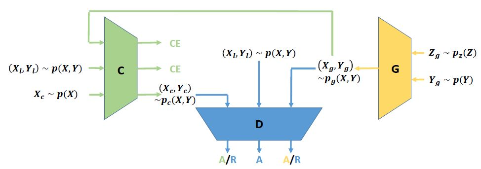
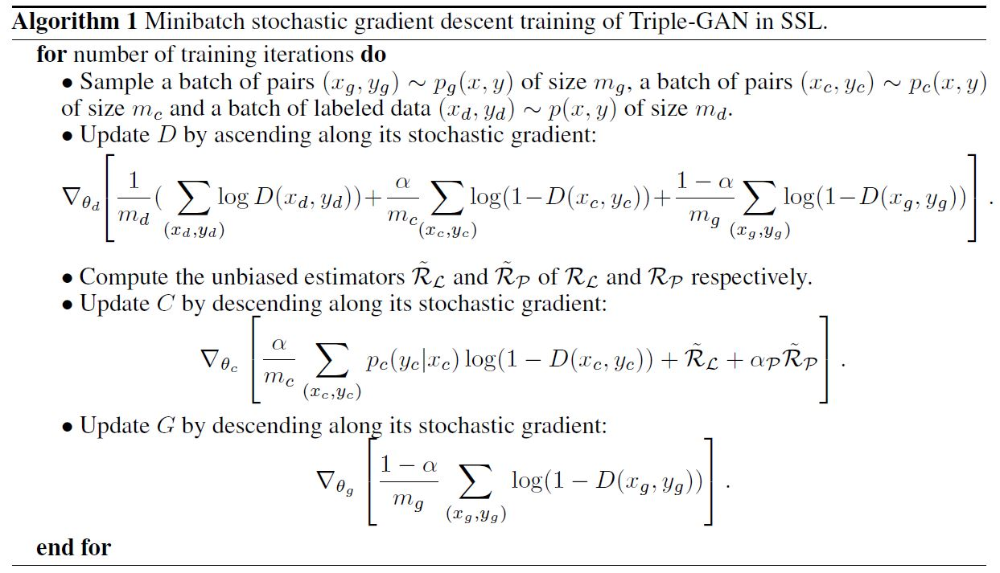
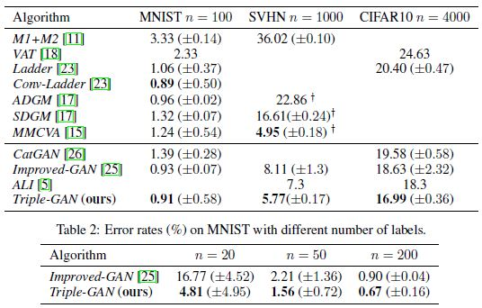
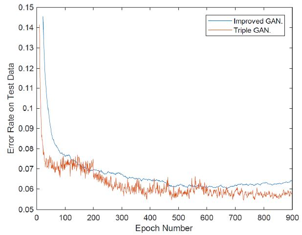
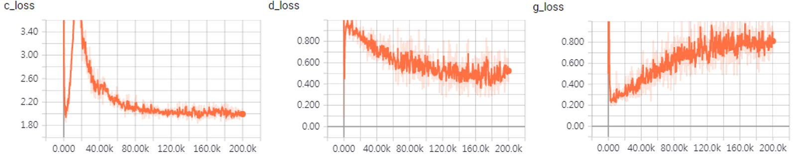
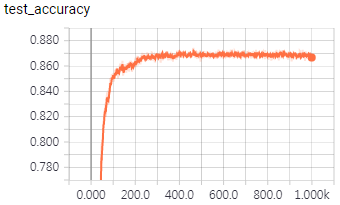
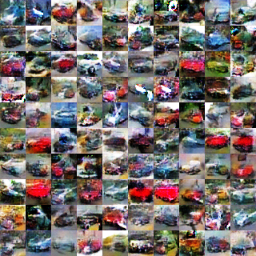

# TripleGAN-Tensorflow
Simple Tensorflow implementation of [Triple Generative Adversarial Nets](https://arxiv.org/pdf/1703.02291.pdf)(Triple-GAN)

If you want to see the original author's code, please refer to this [link](https://github.com/zhenxuan00/triple-gan)

## Issue
* I am now modifying the ***weight normalization*** (If you know how to implement with tensorflow, let me know)

## Usage
```bash
> python main.py --n 4000 --epoch 1000 --batch_size 20 --unlabel_batch_size 250 --z_dim 100
```
* See `main.py` for other arguments.

## Idea
### Network Architecture


### Algorithm


## Result
### Classification result


### Convergence speed on SVHN


## My result (Cifar10, 4000 labelled image)
### Loss


### Classification accuracy


### Generated Image (Other images are in assests)
#### Automobile


## Related works
* [CycleGAN](https://github.com/taki0112/CycleGAN-Tensorflow)
* [DiscoGAN](https://github.com/taki0112/DiscoGAN-Tensorflow)

## Reference
* [tensorflow-generative-model-collections](https://github.com/hwalsuklee/tensorflow-generative-model-collections)

## Author
Junho Kim
