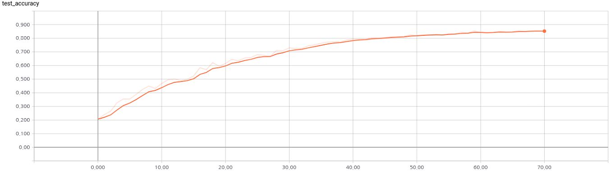

# TripleGAN-Tensorflow
Simple Tensorflow implementation of [Triple Generative Adversarial Nets](https://arxiv.org/pdf/1703.02291.pdf)

If you want to see the original author's code, please refer to this [link](https://github.com/zhenxuan00/triple-gan)

## In progress
### Issue
* I am now modifying the weight normalization (If you know how to implement with tensorflow, let me know)
* I need some more fixes. Please wait for the results

## Idea
### Network Architecture

### Algorithm

## Result
### Classification result

### Convergence speed on SVHN

## My classification result
* 85.4%

## Author
Junho Kim
